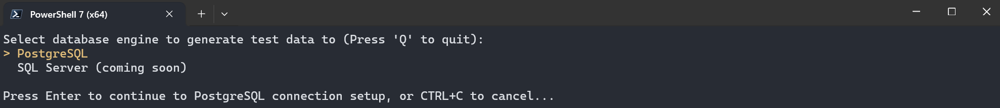
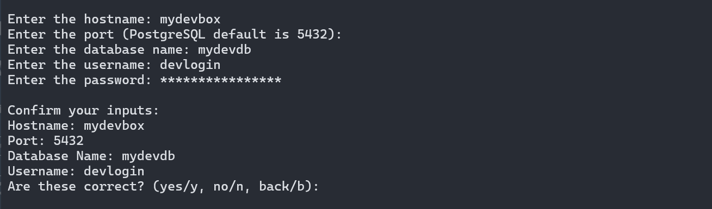
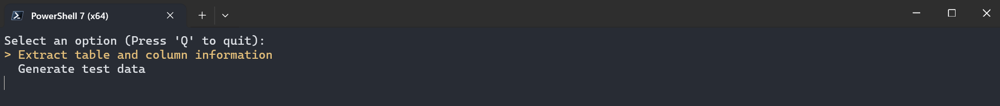
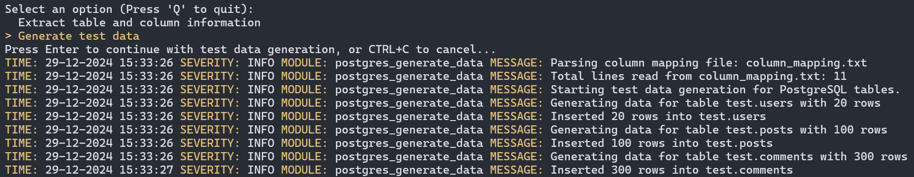

# test-data-generator

A small utility to generate test data for PostgreSQL.

## Overview

This utility helps generate fake data for PostgreSQL databases using the Faker library. It allows you to define the structure and content of the data to be generated in a `column_mapping.txt` file and then inserts the generated data into the specified PostgreSQL tables.

## Features

- Generate fake data for multiple tables and columns.
- Define the number of rows to generate for each table.
- Use various Faker methods to generate different types of data.
- Generate sequential IDs for specified columns.

## Prerequisites

To run the solution in this repository, you'll need to meet the following prerequisites.

- PostgreSQL database (any kind will do, the [example schema](./postgres-schema/example-database.sql) is fairly simple)
- Python 3.x

## Installation

1. Clone the repository:
    ```sh
    git clone https://github.com/MikaSutinen/test-data-generator.git
    cd test-data-generator
    ```

2. Install the required Python packages:
    ```sh
    pip install -r requirements.txt
    ```

## Usage

You can use any Faker supported functions on the file, the file below is from the example schema included in the repository. The ordering of the file follows the PK/FK relationships in the database, so we first start by generating users, then their posts, then their comments.

After each column mapping export, there will also be a row after each table called rows_to_generate. This is used to provide the Faker information about how many rows of data to generate for that specific table. 

## Example Execution

Here is an example of how to use the utility:

1. Start the test data generator:

    ```sh
    python test_data_generator.py
    ```

    There is a simple UI that allows you to navigate through various options. The first option is to select database engine.

    

    It'll ask for confirmation before proceeding with the connection string builder.

    

    Selecting "y" or "yes" moves you to next UI, selecting "n" or "no" restarts the process of entering the connection information again. Selecting "b" or "back" sends you to database engine selector.

    By selecting "y" or "yes" you move to next phase, where you need to select the action to perform. There are two options available:

    

    Depending on your selection, one of the two operations is executed:

2. The tool extracts table and column information. This will generate a `column_mapping.txt` file with the structure of your database tables and all their columns.

    **Note:** This will generate list of all columns from all the tables, including those that you don't need to generate data to. For example, in the example schema in this project there are PKs on the tables that are generated automatically, you should remove those from the `column_mapping.txt` file.
    
    If you are using the example schema from this repository, you can find column mappings from below. In the example, we're generating 20 users, 100 posts and 300 comments.
    
    ```plaintext
    test.users.email = fake.email()
    test.users.name = fake.name()
    test.users.rows_to_generate = 20
    test.posts.content = fake.text()
    test.posts.title = fake.sentence()
    test.posts.user_id = fake.random_int(min=1, max=20)
    test.posts.rows_to_generate = 100
    test.comments.content = fake.text()
    test.comments.post_id = fake.random_int(min=1, max=100)
    test.comments.user_id = fake.random_int(min=1, max=20)
    test.comments.rows_to_generate = 300
    ```

3. The tool will generate test data. Before you can generate test data, you will need to have a `column_mapping.txt` with the column to faker data types mapping. 

### Generate test data:

Once you select the generate data option, it'll do so immediately, using the `column_mapping.txt` file to match columns with proper data. The execution provides logged information on the operations.



## The sample database schema

The database sample in this repository contains 3 tables, a view and a function. All the objects are created in a test-schema.

### Tables

   1. __users__ table contains name, email, user id and date when the user was created
   2. __posts__ table contains title, post content, id of the post and user id to link the rows back to user tables
   3. __comments__ table contains text, comment id and id's back to both user and post tables

### Functions

   1. __get_user_posts(id)__ function retrieves the posts made by the user, example to return posts made by user with user id 2

      ```sql
      SELECT * FROM test.get_user_posts(2)
      ```

### Views

   1. __user_post_count__ retrieves the post counts per user, example use to retrieve post counts for all users

       ```sql
       SELECT * FROM test.user_post_count
       ``` 
   
## Reset the database between loads

Once you've completed the data load and want to return the database to it's initial state, you can do so by running the following commands.

   1. Truncate all the tables using CASCADE option

      ```sql
      TRUNCATE TABLE test.users CASCADE;
      ````

   2. Reset sequences in table PKs

      ```sql
      ALTER SEQUENCE test.users_id_seq RESTART WITH 1;
      ALTER SEQUENCE test.posts_id_seq RESTART WITH 1;
      ALTER SEQUENCE test.comments_id_seq RESTART WITH 1;
      ```

## Improvement ideas

This utility was done rather quickly, so there's naturally room for improvement. Here are few ideas that could make this solution even better.

1. Custom function to generate sequential IDs (useful for generating integer PKs)
2. Automatic detection for FK constraints to set up correct data load order in the column_mapping.txt
3. Support for multiple database engines

## License

This project is licensed under the GNU General Public License. See the [`LICENSE`](command:_github.copilot.openRelativePath?%5B%7B%22scheme%22%3A%22file%22%2C%22authority%22%3A%22%22%2C%22path%22%3A%22%2Fc%3A%2FWork%2FRepositories%2Ftest-data-generator%2FLICENSE%22%2C%22query%22%3A%22%22%2C%22fragment%22%3A%22%22%7D%5D "c:\Work\Repositories\test-data-generator\LICENSE") file for details.